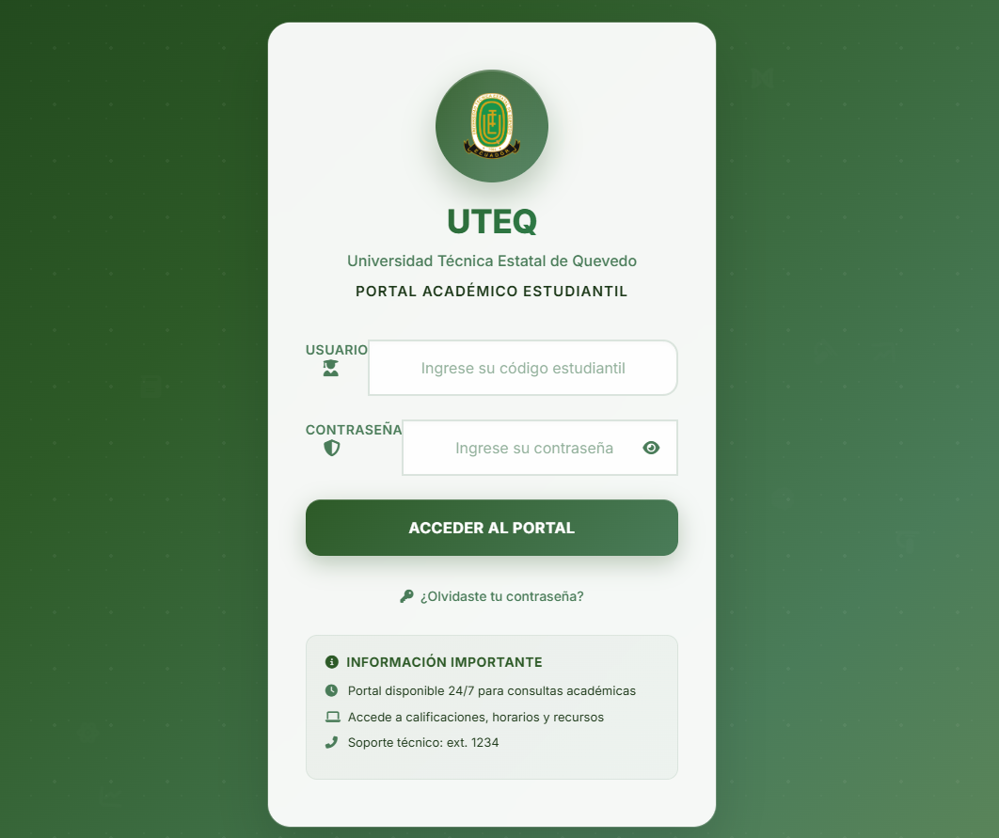

# 🎓 Portal Académico UTEQ - Login Interface

<div align="center">



**Universidad Técnica Estatal de Quevedo**  
*Portal de Acceso Estudiantil Moderno y Seguro*
</div>

---

## 🌟 Descripción del Proyecto

El **Portal Académico UTEQ** es una interfaz de inicio de sesión moderna y elegante diseñada específicamente para la Universidad Técnica Estatal de Quevedo. Combina un diseño visual impactante con funcionalidades avanzadas para brindar una experiencia de usuario excepcional a estudiantes y personal académico.

### ✨ Características Destacadas

🎨 **Diseño Visual Premium**
- Tema institucional en tonos verdes naturales
- Efectos glassmorphism y degradados modernos
- Animaciones fluidas y micro-interacciones
- Elementos flotantes temáticos académicos
- Logo circular con efectos shimmer

🔐 **Seguridad y UX**
- Validación en tiempo real de formularios
- Toggle para mostrar/ocultar contraseña
- Estados de carga con feedback visual
- Navegación por teclado optimizada
- Placeholders inteligentes y auto-formateo

📱 **Diseño Responsive**
- Compatible con todos los dispositivos
- Adaptación automática a móviles y tablets
- Optimizado para pantallas táctiles
- Mantenimiento de funcionalidades en todos los tamaños

## 🚀 Tecnologías Utilizadas

| Tecnología | Versión | Propósito |
|------------|---------|-----------|
| **HTML5** | Latest | Estructura semántica |
| **CSS3** | Latest | Estilos modernos y animaciones |
| **JavaScript** | ES6+ | Interactividad y validaciones |
| **Bootstrap** | 5.3.3 | Sistema de grid responsive |
| **Font Awesome** | 6.4.0 | Iconografía profesional |
| **Google Fonts** | Inter | Tipografía institucional |

## 📁 Estructura del Proyecto

```
uteq-portal-login/
│
├── 📄 index.html              # Archivo principal del login
├── 📁 assets/                 # Recursos multimedia
│   ├── 🖼️ logo-uteq.png       # Logo oficial de UTEQ
│   └── 🖼️ fondo.jpg          # Imagen de fondo (opcional)
├── 📁 css/                    # Estilos adicionales (opcional)
├── 📁 js/                     # Scripts adicionales (opcional)
└── 📋 README.md              # Este archivo
```

## ⚙️ Instalación y Configuración

### 📋 Requisitos Previos
- Navegador web moderno (Chrome, Firefox, Safari, Edge)
- Servidor web local (opcional para desarrollo)

### 🛠️ Configuración Rápida

1. **Clona o descarga el proyecto**
   ```bash
   git clone https://github.com/tu-usuario/uteq-portal-login.git
   cd uteq-portal-login
   ```

2. **Agrega tu logo institucional**
   ```
   Coloca tu archivo logo-uteq.png en la carpeta assets/
   ```

3. **Abre el archivo en tu navegador**
   ```
   Doble clic en index.html o usa un servidor local
   ```

### 🔧 Personalización

#### Cambiar Colores Institucionales
```css
:root {
    --primary-green: #2d5a27;      /* Verde principal */
    --secondary-green: #4a7c59;    /* Verde secundario */
    --accent-green: #6b8e5a;       /* Verde de acento */
    /* Personaliza según tu institución */
}
```

#### Configurar Logo
```html
<!-- Reemplaza la ruta con tu logo -->

```

#### Ajustar Información Institucional
```html
<h1 class="university-name">UTEQ</h1>
<p class="university-subtitle">Universidad Técnica Estatal de Quevedo</p>
<p class="portal-title">Portal Académico Estudiantil</p>
```

## 🎯 Funcionalidades Principales

### 🔍 Validación de Formularios
- **Código Estudiantil**: Formato automático y validación
- **Contraseña**: Toggle de visibilidad y verificación
- **Estados de Error**: Feedback visual inmediato

### 🎭 Efectos Visuales
- **Partículas Flotantes**: Elementos académicos animados
- **Parallax Sutil**: Movimiento con el cursor
- **Hover Effects**: Transformaciones suaves
- **Loading States**: Animaciones de carga

### 📲 Accesibilidad
- **Navegación por Teclado**: Tab y Enter optimizados
- **Contraste Adecuado**: Cumple estándares WCAG
- **Semántica HTML**: Estructura accesible
- **Responsive Design**: Funciona en cualquier dispositivo

## 🌈 Paleta de Colores

| Color | Hex Code | Uso |
|-------|----------|-----|
| 🌲 Verde Bosque | `#1a3d17` | Fondo principal |
| 🍃 Verde Primario | `#2d5a27` | Elementos principales |
| 🌿 Verde Secundario | `#4a7c59` | Acentos y detalles |
| 🌱 Verde Claro | `#6b8e5a` | Degradados |
| ⚪ Blanco | `#ffffff` | Texto y fondos |

## 🔮 Características Avanzadas

### 💫 Animaciones CSS
- **Keyframes Personalizados**: Movimientos fluidos
- **Transform 3D**: Efectos de profundidad
- **Backdrop Filter**: Efectos de desenfoque
- **CSS Grid & Flexbox**: Layouts modernos

### 🧠 JavaScript Inteligente
- **Event Listeners**: Interactividad avanzada
- **LocalStorage Ready**: Preparado para persistencia
- **Modular Code**: Fácil mantenimiento
- **Error Handling**: Manejo robusto de errores

## 📊 Rendimiento

- ⚡ **Carga Rápida**: < 2 segundos en conexiones normales
- 📱 **Mobile First**: Optimizado para dispositivos móviles
- 🚀 **Lightweight**: Tamaño mínimo sin sacrificar funcionalidad
- ♿ **Accesible**: Cumple estándares de accesibilidad web

## 🛡️ Seguridad

- 🔐 **Validación Client-Side**: Primera línea de defensa
- 🔒 **Input Sanitization**: Limpieza de datos de entrada
- 🛡️ **XSS Protection**: Prevención de scripts maliciosos
- 🔑 **Password Masking**: Ocultación segura de contraseñas

## 🤝 Contribución

¡Las contribuciones son bienvenidas! Si deseas mejorar este proyecto:

1. 🍴 Fork el repositorio
2. 🌟 Crea una rama para tu feature (`git checkout -b feature/AmazingFeature`)
3. 💾 Commit tus cambios (`git commit -m 'Add some AmazingFeature'`)
4. 📤 Push a la rama (`git push origin feature/AmazingFeature`)
5. 🔃 Abre un Pull Request

## 📝 Changelog

### v1.0.0 (2024)
- ✅ Diseño inicial con tema universitario
- ✅ Implementación de animaciones avanzadas
- ✅ Sistema de validación de formularios
- ✅ Diseño responsive completo
- ✅ Integración con Bootstrap 5.3.3

## 📞 Soporte y Contacto

- 🌐 **Web**: [www.uteq.edu.ec](https://www.uteq.edu.ec)
- 📧 **Email**: soporte.ti@uteq.edu.ec
- 📱 **Teléfono**: +593 (05) 275-0365
- 📍 **Dirección**: Av. Quito km 1.5 vía a Santo Domingo de los Tsáchilas

---

<div align="center">

### 🎓 Universidad Técnica Estatal de Quevedo
**Excelencia Académica • Innovación Tecnológica • Compromiso Social**

---

*© 2024 UTEQ - Portal Académico. Todos los derechos reservados.*

</div>
